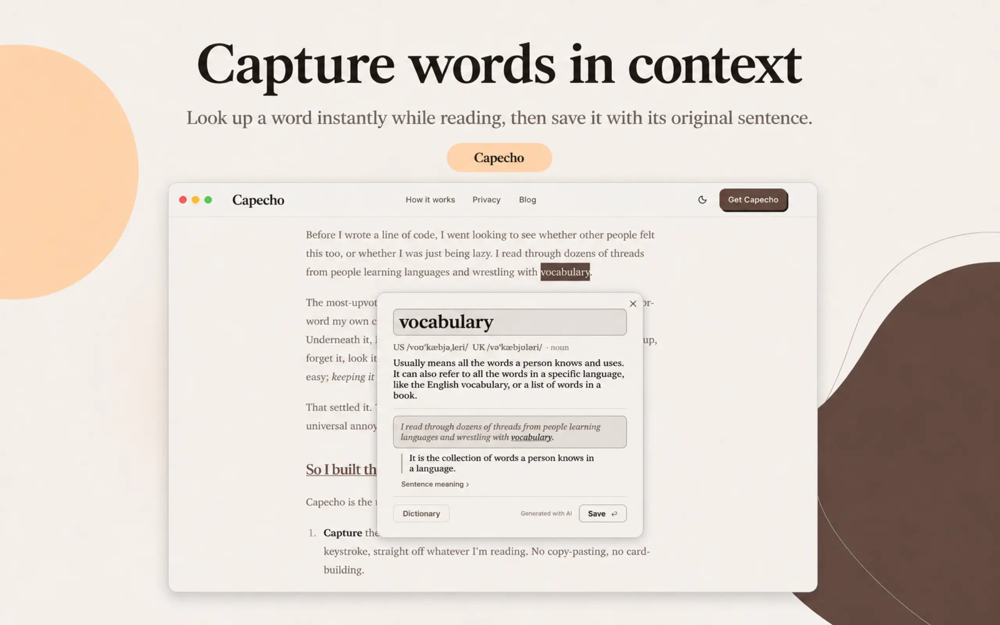

# Capecho

> **Cap**ture + **echo.** Capture the words you meet while reading (desktop), understand them in
> context, and review them with spaced repetition (phone) so they stick.

 · [**Download on the App Store**](https://apps.apple.com/app/id6771973675)

Capecho is a capture-first vocabulary memory tool. You highlight a word while reading; Capecho saves
it **with the sentence it lived in**, generates a context-aware explanation, and feeds it back to you
on a spaced-repetition schedule. English is the go-to-market wedge, but the architecture is
multi-target — the target language is a per-capture user choice, never hard-coded.

## Source-available & pricing pledge

Capecho is **source-available under the [Functional Source License (FSL-1.1-Apache-2.0)](LICENSE)** —
clients, backend, and shared packages, all in this repo. Read it, audit it, self-host it, modify it.
It's [Fair Source](https://fair.io/): the one thing it doesn't allow is using the code to ship a
product or service that competes with Capecho — and every release becomes Apache-2.0 two years after
it ships.

### Why source-available, not open source?

We wanted the code **fully auditable** — you can verify for yourself that capture never uploads a
screenshot and that metering is honest — without letting someone clone it into a competing product. FSL
gives you almost everything a permissive license does (use, study, self-host, modify, even commercially)
with **one** carve-out: you can't ship a product or service that competes with Capecho. And it isn't
forever — **every release automatically becomes Apache-2.0 two years after it ships**, so the code is
always on a path to fully open.

**Pricing pledge: capturing, saving, and reviewing your words is free, forever.** We only charge for
the per-use AI — the in-context explanation (the word as used in *your* sentence): 10/day free,
unlimited on **Pro**. Word-level explanations, unlimited saved words, FSRS review, cross-device sync,
and Anki/CSV export are all free. We price what costs us per use, nothing else.

The **Capecho name and brand** are trademarks and stay reserved (see [TRADEMARK.md](TRADEMARK.md)) —
build on the code, just under your own name. Contributing:
[CONTRIBUTING.md](CONTRIBUTING.md) · Security: [SECURITY.md](SECURITY.md) · Third-party notices:
[THIRD_PARTY_NOTICES.md](THIRD_PARTY_NOTICES.md).

## Status

**Canonical status + version live in [`CHANGELOG.md`](CHANGELOG.md) and [`VERSION`](VERSION).** In
short: the **macOS client** (capture → save, account + sync, notarized direct download + Mac App Store)
and the **iOS client** (sign-in, touch Review, Word Book, Settings) are live, and the **backend is the
Cloudflare source of truth**. Capture is Mac-first; Android + mobile capture are ahead.

## Repository map

| Path | What it is | Entry |
|---|---|---|
| [`clients/macos/`](clients/macos/) | Flutter **macOS** app — a menu-bar agent: onboarding, capture overlay, Review, Word Book, Settings. | [README](clients/macos/README.md) |
| [`clients/mobile/`](clients/mobile/) | Flutter **iOS/Android** app — the "echo" half: sign-in, touch Review, Word Book, Settings. | [README](clients/mobile/README.md) |
| [`clients/capture_native/`](clients/capture_native/) | Swift/AppKit + Dart **capture plugin** — warm-glass overlay, screen-capture/OCR, fsync'd journal. | [README](clients/capture_native/README.md) |
| [`backend/`](backend/) | **Cloudflare Workers + D1** — explanations + cost plane, server-authoritative FSRS + sync, auth, export. | [README](backend/README.md) |
| [`shared/`](shared/) | Cross-client Dart/TS packages (see below). | per-package |
| [`web/`](web/) | The public **Next.js marketing site**. | [README](web/README.md) |
| [`DESIGN.md`](DESIGN.md) · [`design/tokens.css`](design/tokens.css) | The **design system** — aesthetic, type, color, tokens. | [DESIGN.md](DESIGN.md) |

### `shared/` packages

| Package | What |
|---|---|
| [`shared/app-core`](shared/app-core/) · `capecho_app_core` | Shared auth/review/Word Book/settings controllers + sign-in panel + warm design system both clients build on. |
| [`shared/api-client`](shared/api-client/) · `capecho_api` | The typed backend client both clients use. |
| [`shared/local-store`](shared/local-store/) · `capecho_local_store` | The device-local SQLite mirror + the durable-save journal drain. |
| [`shared/capture-core`](shared/capture-core/) | Platform-neutral capture reconstruction. |
| [`shared/design-tokens`](shared/design-tokens/) | Generates Dart/Swift design tokens from the CSS source. |
| [`shared/lang`](shared/lang/) | BCP-47 canonicalization + the language allowlists. |

## Start here

| You want to… | Read |
|---|---|
| See / implement the design | [`DESIGN.md`](DESIGN.md) + [`design/tokens.css`](design/tokens.css) |
| Build or run a package | that package's README (map above) |
| Contribute | [`CONTRIBUTING.md`](CONTRIBUTING.md) |
| Work on this repo as an AI agent | [`CLAUDE.md`](CLAUDE.md) |

The product invariants (multi-target, immutable captured unit, server-authoritative FSRS, capture never
uploads a screen image) are summarized in [`CLAUDE.md`](CLAUDE.md). When a doc and the code disagree,
**the code wins** — please fix the doc.
